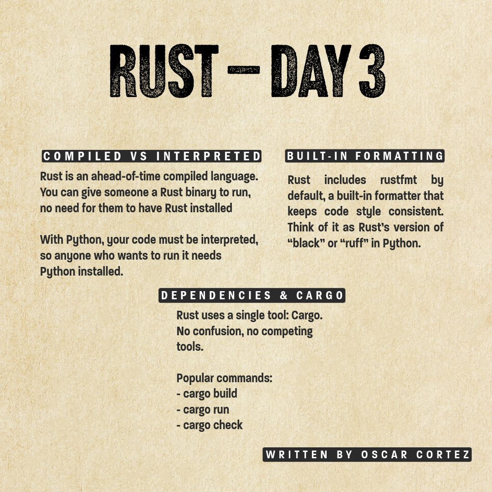

--- 
title: "Learning Rust Day 3: Cargo and Compilation Fundamentals"
date: 2025-06-25T17:50:00
draft: false
description: "Exploring Rust's powerful package manager and the benefits of ahead-of-time compilation for building executables."
topics: ["rust", "tutorial"]
---

#LearningRust day 3

----------------------------------------------
Some basic concepts from the book:

“Rust is an ahead-of-time compiled language, meaning you can compile a program and give the executable to someone else, and they can run it even without having Rust installed.”

With #Python code, you don't need to compile, but then, whoever wants to run your code, would need Python installed to run it.

----------------------------------------------

Interestingly, #Rust comes with rustfmt, a formatter that helps maintain a consistent code style, much like ruff or black for Python.

----------------------------------------------

Regarding managing dependencies, there is only one tool “Cargo”. For those coming from Python, you know there have been lots of options for managing dependencies, and each one has its flavor on how to do it. It looks like this is not a problem in the Rust ecosystem.

Some common cargo commands:

- cargo build -> produces the binary
- cargo run -> produces and runs the binary
- cargo check -> It skips the step of producing the binary, thus, much faster than cargo build and still checks for errors.

#Rust #LearningRust


