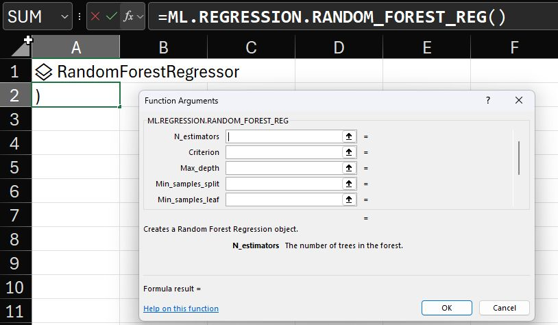

--- 
title: "Implementing Random Forest in formulaML for Excel"
date: 2025-06-26T17:00:00
draft: false
description: "Adding one of the most powerful and versatile ML algorithms to the formulaML add-in and leveraging the performance of scikit-learn."
topics: ["machine-learning", "tutorial"]
---

Random Forest is a popular machine learning algorithm that combines the output of multiple decision trees, each trained on a random subset of data and features. Then, it aggregates the predictions of these trees to get the final result.

Some of the advantages are:

1️⃣ High accuracy / Less Overfitting.
2️⃣ No need for data standardization/scaling.
3️⃣ Handles non-linearity very well.
4️⃣ Handles missing values.
5️⃣ Provides useful information for feature importance.

I'm still working on adding the minimum functionality for the formulaML beta testing. I didn't want people to test it without incorporating the Random Forest 🌳 (both Regressor and Classifier). It is now included in the #Excel add-in!

I discovered an interesting fact when adding this algorithm to formulaML: the scikit-learn implementation uses an underlying tree written in Cython. This compiles directly to C, offering significant performance advantages over a pure #Python version. 🚀

Stay tuned for the beta testing. If you haven't signed up for the waiting list, check the first comment. The beta testing spots are limited!

#excel #dataanalytics #machinelearning


