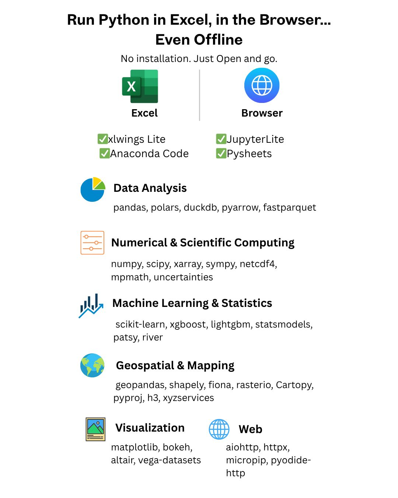

--- 
title: "Exploring Offline Python Environments: Pyodide, xlwings Lite, and Beyond"
date: 2025-07-02T19:49:00
draft: false
description: "Discover how to run a vast array of scientific and data science libraries directly in your browser or Excel without any installation."
topics: ["python", "excel", "tutorial"]
---

Python in Excel or the browser—fully offline. No servers. No installs. Just plug-n-code

Sounds too good to be true?

That’s exactly what tools like xlwings Lite, Anaconda Code, JupyterLite, and PySheets make possible today.

✅ Run Python code right inside Excel
✅ Or launch a full Python notebook in the browser
✅ All powered by Pyodide—an offline Python runtime that runs in your browser

But here’s the real question:

👉 What libraries can you actually use in this environment?
The good news: tons of your favorite ones are already supported—from pandas and matplotlib to scikit-learn, xgboost, bokeh, and more.

👇 I’ve grouped the most useful libraries by use case so you can explore what’s possible without digging through docs.

📊 Data Analysis
    •    pandas, polars, duckdb
    •    pyarrow, fastparquet

🔢 Numerical & Scientific Computing
    •    numpy, scipy, xarray
    •    sympy, netcdf4, mpmath, uncertainties

📈 Machine Learning & Statistics
    •    scikit-learn, xgboost, lightgbm
    •    statsmodels, patsy, river

🌍 Geospatial & Mapping
    •    geopandas, shapely, fiona, rasterio
    •    Cartopy, pyproj, h3, xyzservices

🖼️ Visualization
    •    matplotlib, bokeh, altair, vega-datasets

🌐 Web & Async Tools
    •    aiohttp, httpx, micropip, pyodide-http

You don’t need to install Python in your computer anymore.

Just open Excel or a browser—and go.


