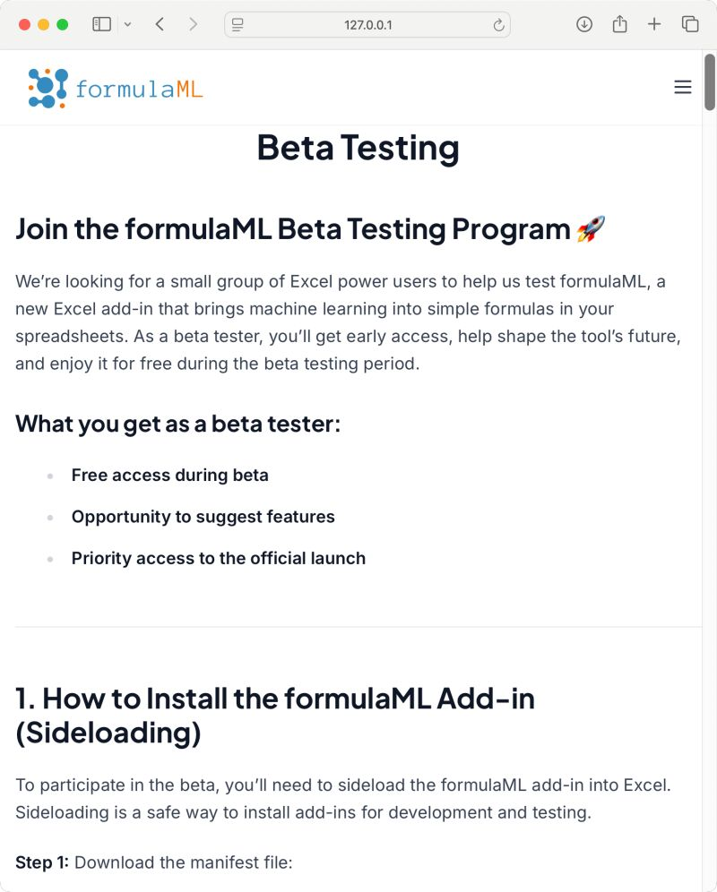

--- 
title: "5 Surprising Lessons from Building My First Website"
date: 2025-07-03T22:34:00
draft: false
description: "Reflecting on domains, static site generators, and SEO from the perspective of a first-time web developer."
topics: ["web-development", "tutorial", "opinion"]
---

Here are 5 funny things I learned building my first website... 
and what it taught me about the internet.

I just wanted my own little corner of the web. No ChatGPT back then—just deep Google dives, blog posts, and a few books. Here is what surprised me:

1. Domains can be very cheap or crazy expensive.

I got oscarcortez .me free for 2 years via GitHub Education.
But the .com version? $3395 😅

Turns out domains are like digital real estate, some people buy them just to flip them later.

2. I had no clue what a “static” website was.

At first, I thought every site needed backend code.
(Nope.)

Static sites don’t need servers or databases.
And no, “dynamic” doesn’t mean it has fancy animations 😂

Look up JAMstack, it's amazing.

3. Website builders aren’t your only option.

They’re easy... but can be pricey.

Then I found static site generators like HUGO.
They use templates + Markdown. Minimal HTML/CSS.
I built my whole site with almost no frontend code.

4. DNS records = the internet’s phonebook.

DNS maps your domain (like google .com) to an IP address.

I learned how to set DNS records to configure email addresses, redirects, and subdomains. Super useful once you get use to it.

5. SEO is more than just keywords.

SEO = Search Engine Optimization. It’s how people find your site.

HUGO is great for SEO because it’s fast, uses clean HTML, and makes metadata easy to customize.

These help boost your site in Google results.

That’s just a bit of what I’ve learned in the process.

📸 Screenshot below is from the upcoming FormulaML beta testing page. Instructions and access coming soon.

Spots will be limited—stay tuned!


