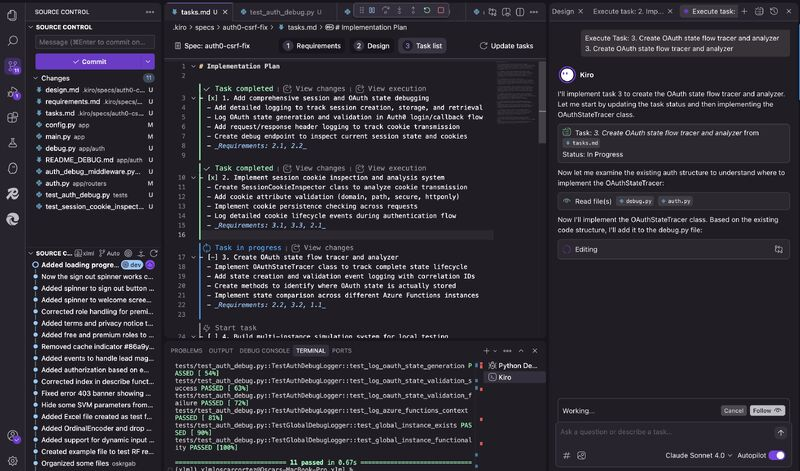

--- 
title: "First Impressions of AWS Kiro: A Spec-Driven AI IDE"
date: 2025-07-16T17:00:00
draft: false
description: "Exploring the unique features of Amazon's new AI coding assistant and how it simplifies planning and implementation."
topics: ["ai-tools", "opinion"]
---

I have been testing Kiro for a couple of days, and I have to say that it is great!

Kiro is a new AI IDE by AWS, and it is free to try with some good limits on usage.

It exclusively uses Claude Sonnet 4.0 and 3.7, which is sort of expected given that Amazon has a good stake in Anthropic, and I believe there is some sort of close collaboration.

Its best feature is the Specs definition. It is a three-part plan:

1️⃣ Requirements
2️⃣ Design
3️⃣ Tasks 

This acts as a normal chat between you and Claude, explaining what you want, how you want it, and success criteria.

This applies to the design and task list. You can refine them anytime or revisit the requirements if needed. Claude reviews your codebase to align requirements, design, and tasks.

Now, it is the task list that will be actually executed. Above each task list, you'll see a clickable "Start Task" text. This will launch Claude to actually start writing the code.

I love Kiro mainly for its Specs feature. Unlike Cursor, where I kept switching between tasks and using ChatGPT to understand the bigger picture, Kiro simplifies planning and task implementation.

Make sure to try Kiro now, it is free, and it's using top tier models with very good limits on usage, so take advantage of it while in Preview!


