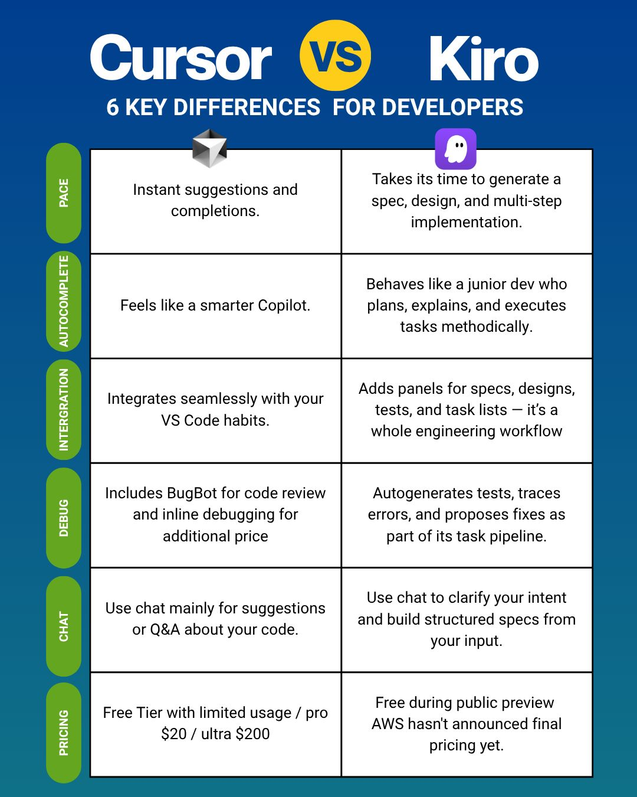

--- 
title: "Kiro vs. Cursor: A Week of Comparative AI Coding"
date: 2025-07-21T22:25:00
draft: false
description: "Reflecting on the practical differences between two of the most popular AI-integrated development environments."
topics: ["ai-tools", "opinion"]
---

I've been using Kiro for over a week now (I was fortunate to get access before the waitlist). Having used Cursor for over a year, here are some differences between the two IDEs:


