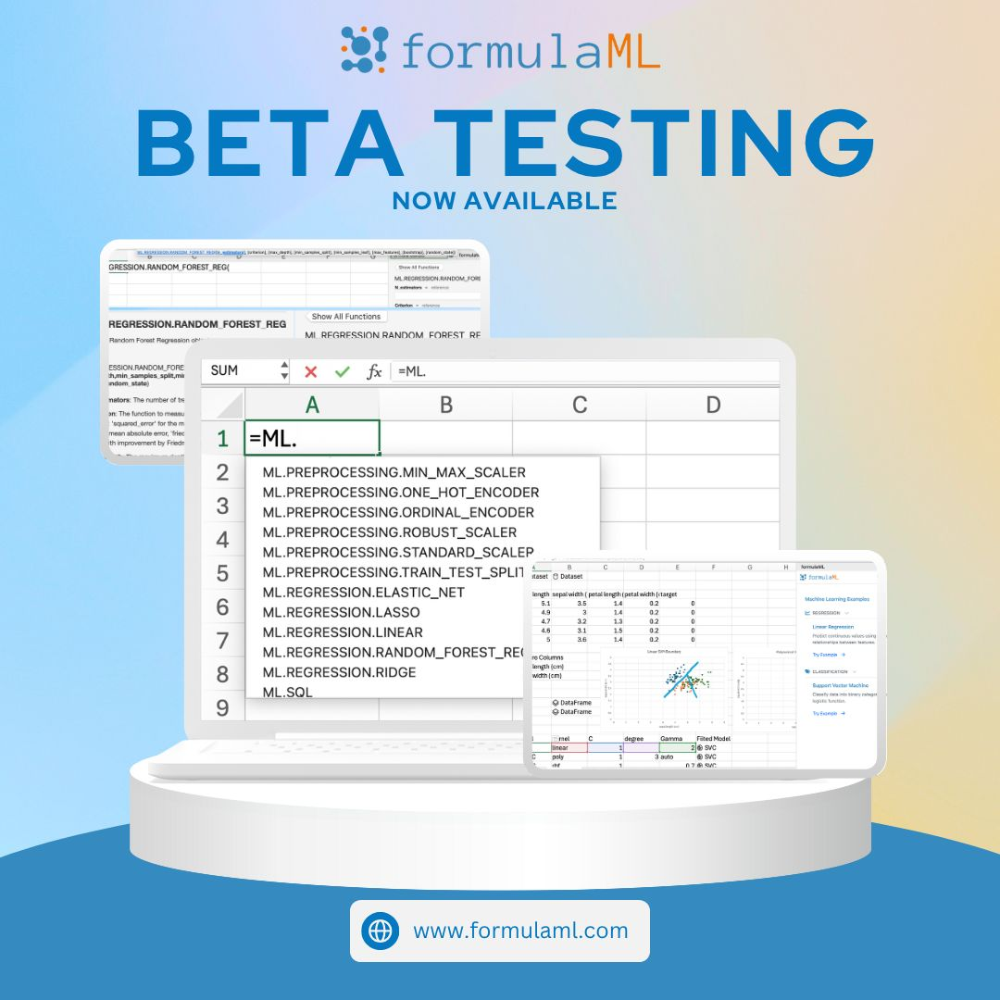

--- 
title: "formulaML Beta Testing Now Live: Try ML Directly in Excel"
date: 2025-08-08T16:51:00
draft: false
description: "Get early access to formulaML and start running regressions, clustering, and random forests using simple spreadsheet formulas."
topics: ["machine-learning", "excel", "formulaml", "tutorial"]
---

If you want to try Machine Learning in #Excel, the formulaML Beta Testing is now live. 

🚀 No Python. No switching tools. Just formulas.

✅ Get free access to all formulaML features
✅ Try built-in examples to hit the ground running
✅ Help shape the final release with your feedback

If you're unsure where to begin, try the examples embedded in the add-in to see how to tailor it to your data. We are adding more formulas and more functionality every week! Here are some of the things you can already try:

- Linear/Logistic Regression
- SVM (including kernel SVM)
- K-means clustering
- Random Forest Classifiers and Regressors

On top of that, there are many preprocessing formulas that can help you build a pipeline, all the way from data transformation to model evaluation.

📌 Follow @formulaML for updates, tips, and examples.

💬 Try it, break it, love it, and let us know what you'd like to see next!


