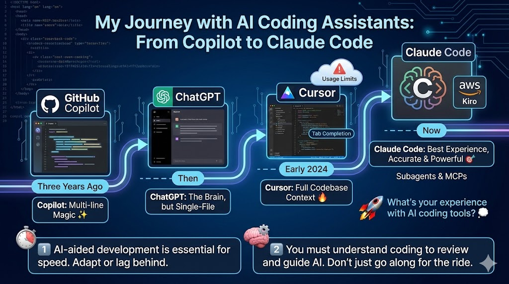

--- 
title: "My Journey with AI Coding Assistants: From Copilot to Claude Code"
date: 2025-08-15T18:31:00
draft: false
description: "Reflecting on 3 years of AI-aided development and the lessons learned about maintaining control while boosting efficiency."
topics: ["ai-tools", "programming", "opinion"]
---

I've been coding with AI lately, and I can't go back. Here's my journey so far 🚀

Three years ago: Started with Copilot. The multi-line autocompletion felt like magic ✨

Then: Added ChatGPT to the mix. Great combo, but couldn't make cross-file changes.

Early 2024: Switched to Cursor. It understood my full codebase and knew where to make changes. Tab completion was amazing 🔥

Problem: Cursor's pricing and usage limits pushed many users (including me) to look for alternatives 😅

Few weeks ago: Tried AWS Kiro. Uses Claude 4 Sonnet exclusively and has spec-driven development. Good limits during preview phase. But I kept hitting caps and realized I could replicate specs with custom instructions.

Now: Using Claude Code. By far the best experience. More accurate results, and the subagents + MCPs combination is fantastic 🎯

Two things I've learned:

1️⃣ AI-aided development is here to stay. If you don't adopt it, you'll develop much more slowly than your peers.

2️⃣ You still need to understand coding. These models provide accurate answers, but they can also mislead you. Review their code, correct it, guide it. Without coding knowledge, you're just along for the ride.

What's your experience with AI coding tools? 💭


