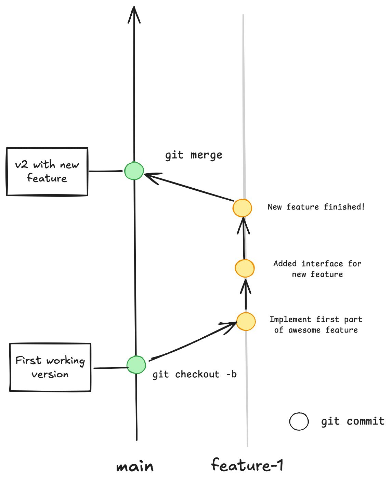

--- 
title: "Vibe Coder's Guide to Git: Mitigating Risks in AI-Aided Development"
date: 2025-09-01T20:23:00
draft: false
description: "Essential Git workflows for those using AI assistants to ensure you can always recover from breaking changes."
topics: ["git", "ai-tools", "tutorial"]
---

How to mitigate the risk of screwing up your app codebase (Vibe coder edition). 🛠

TL;DR: Use git. 💻

Picture the following:

You are starting an app concept using your favorite LLM Code assistant (GH Copilot, Cursor, Claude Code, Codex, etc) 🚀

The initial prompts look great, so you continue. Your LLM partner handles the backend, frontend, and runs tests, all passing. You successfully load your app on localhost.

Life's good, you're in the flow, and adding features. But suddenly, the original app features stop working.

You ctrl + z, restore previous checkpoints, but still, it doesn't work. The LLM touched many files that these restore points are not fully realiable. Besides, you need to navigate through the endless conversations to see where the breaking changes were introduced.

And because you are Vibe Coder, chances are that you don't understand what the actual code is doing. 😅

Do yourself a favor and USE GIT! ✨

Quick steps to leverage Git:

- Download git.
- Use 'git init' in your project folder to start the repo
- Save the first working app version in your "main" branch using the 'git commit'
- Create a new branch from main 'git checkout -b <branch-name>'

- Ask the LLM for specific/incremental changes.
- Under the new branch name, call 'git commit' and save your changes
- If something goes wrong, revert to a previous version of the app using 'git checkout'.
- If everything is ok, you can merge your "new-feature-branch" to main

In a nutshell:

🔄 Request small changes
📥 git commit
🔀 git checkout
🔗 git merge
🔁 Repeat for every new feature

If you don’t know what git, commit, branching or even what the terminal is, tell the LLM to explain it to you, it’s going to be the best token usage in the whole year.


