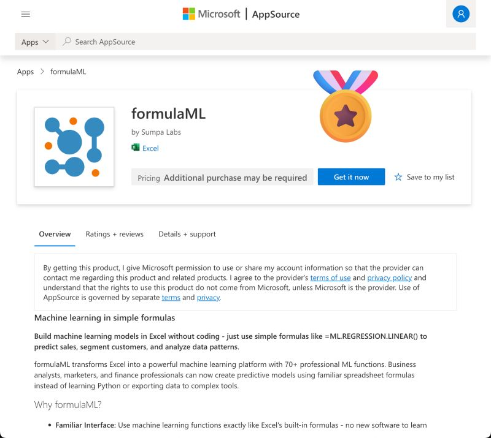

--- 
title: "formulaML is Now Live on Microsoft AppSource: The Journey of an Excel Add-in"
date: 2025-10-09T17:00:00
draft: false
description: "Reflecting on the technical and administrative challenges of publishing my first professional add-in for the Microsoft ecosystem."
topics: ["excel", "formulaml", "announcement"]
---

I am proud to announce that my first Excel add-in is live on Microsoft's AppSource! 🚀

This has been an amazing experience and learned a lot along the way:

- Microsoft Azure
- Authentication
- Javascript (Office.js)
- htmx
- Jinja templates
- more FastAPI

And of course xlwings  server by Felix Zumnstein! The documentation is amazing and you can get up and running in minutes.

Just having the add-in wasn't enough though, then I had to navigate the process to become a MS partner, going through the validation process, and finally reviewing the add-in with Microsoft testing support.

Here's what drives formulaML: I believe every business analyst should have ML at their fingertips, not hidden behind Python scripts. So I made it work with Excel formulas they already use daily. Building this has been addictive – can't wait to ship outlier detection and time series analysis next!

Let me know if you have any questions regarding the process of publishing the add-in!


