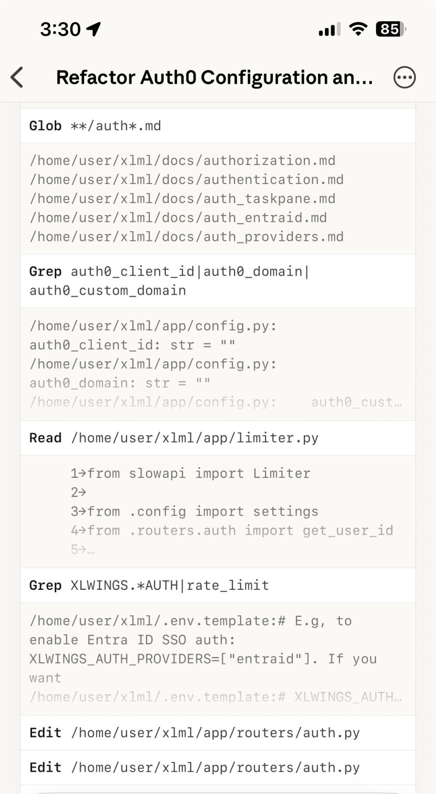

--- 
title: "Mobile Coding Workflows with Claude Code for iOS"
date: 2025-10-21T20:33:00
draft: false
description: "Taking advantage of cross-platform AI assistants to explore refactors and ideas while on the go."
topics: ["ai-tools", "mobile"]
---

I just updated the Claude app for iOS and it also has Claude Code on the web! 

Now I can start running tasks while I’m in the phone and review when I get home, amazing! 

This truly helps taking advantage of the Max plan since I was hardly using it when I was coding on my laptop. 

Now I can explore options, refactors and general ideas on how to solve things before I get to the computer myself.

Try it out!


