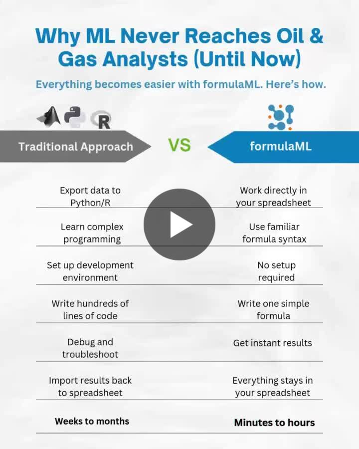

--- 
title: "Closing the Gap Between Oil & Gas Workflows and Machine Learning"
date: 2025-11-25T18:00:00
draft: false
description: "Why formulaML is essential for energy teams who rely on Excel but need modern analytical capabilities for production and modeling."
topics: ["excel", "machine-learning", "oil-and-gas", "formulaml"]
---

Oil & Gas runs on Excel. Machine Learning doesn’t. And that gap is costing teams time, accuracy, and opportunities.

Over 70% of technical workflows in Oil & Gas still run on Excel, from reservoir modeling to budgeting to production forecasting.
It’s the backbone of the industry…
but machine learning still lives outside of it.

Every reservoir model, type curve, forecast, economics sheet, and production dashboard begins in Excel.
So why can’t ML live there too?

Most analysts understand models, metrics, and preprocessing,
but can’t actually use machine learning because their entire workflow is trapped inside spreadsheets.

And that leads to problems we all recognize:

Excel is the natural environment, but it has no modern ML algorithms.

Companies block Python/R installations or external libraries.

The workflow becomes dependent on someone else from the technical/data team.

Predictions and models are generated outside Excel, far from the decision-maker.

And the classic “just use Solver” workaround doesn’t scale, isn’t reproducible, and isn’t ML.

The gap between Excel-based workflows and ML capabilities is real,
and deeper than it seems.

Running machine learning inside Excel has always been difficult if you don’t code:
no algorithms, no reproducible pipelines, no control from within the sheet.

formulaML aims to close that gap.

A simple add-in that allows you to run complete ML models as if they were native Excel functions:

✅No code

✅No installations

✅No environment setup

✅No external dependencies

Just one formula, and you get predictions directly in Excel.

The technical beta is now open for anyone who wants to test it, validate real O&G workflows, or simply see how an ML engine behaves inside a spreadsheet.

If you work in Excel, care about ML, or deal with restrictive IT environments.
I’d love to hear your thoughts.


