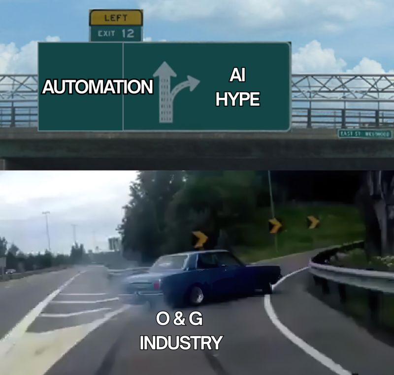

--- 
title: "The Oil & Gas Digital Transformation Ladder: Automation Before AI"
date: 2025-12-02T18:34:00
draft: false
description: "Why building a solid foundation of analytical automation and optimization is critical before jumping into complex ML models."
topics: ["oil-and-gas", "automation", "opinion"]
---

The #1 Mistake in Oil & Gas: Rushing to AI and Forgetting Automation.

We are drowning in data, but starving for insights. Automated systems and sensors are everywhere now. 

They produce massive amounts of information that conventional methods simply cannot digest. This "data density" is why we need ML, but we are applying it in the wrong order.

We have to differentiate between the Hype (LLMs/GenAI) and the Usefulness (ML & Automation).

Too many teams jump straight to "AI" without building a solid ground first.

Here is the technical reality check we need:

1. Don't skip the "Analytical" Automation
I see engineers trying to train a Tree Ensemble with 200 features when they only have 100 wells. That is not data science; that is overfitting. The Fix: Can you first automate your DCA process with proper data mining and Bayesian inference? If you can't automate the analytical solution, you aren't ready for the black box.

2. The "Baseline" Problem
For any regression ML algorithm, you need a baseline. A fancy predictive algorithm is useless if it can't beat a simple average of your data or a fundamental physics-based method. The Fix: Classical analysis remains the backbone. If your model can't outperform a calibrated Material Balance, a Line-Source solution, or Darcy’s Law, throw it out.

3. Target Operations, Not Just Simulation
We all love better reservoir simulation and geomodeling, but proving short-term ROI there is hard. It often turns into a "research project". The Fix: The most common, high-value implementations are close to operations:

❇️ Artificial lift optimization.
❇️ Predictive failures.
❇️ Water/gas flooding balancing.
❇️ Drilling optimization.

Your Digital Transformation Ladder:

Automation ➡️  Optimization ➡️  ML ➡️  DL ➡️  LLM

Don't let the hype push you to the top step before you've built the bottom one.

What is the one manual task you’d automate right now?


