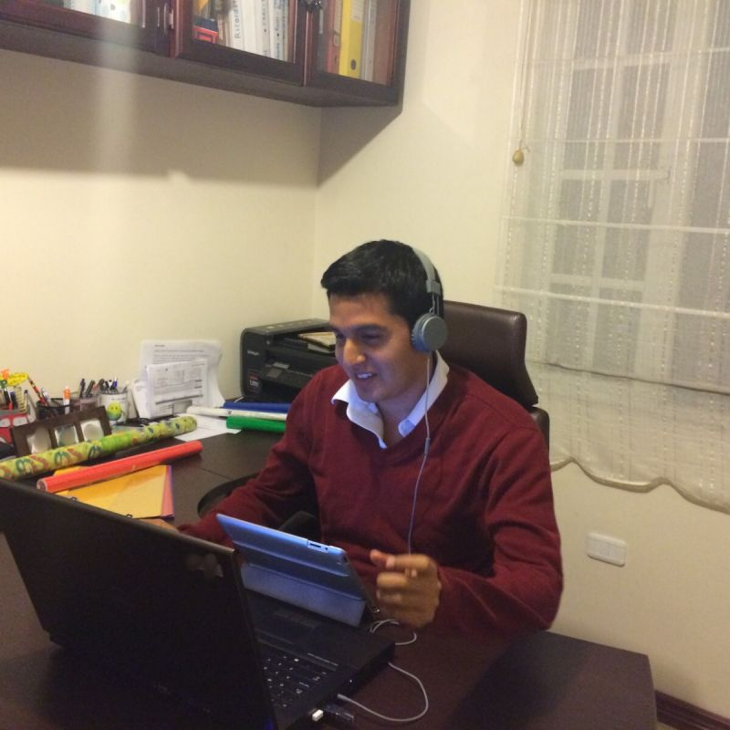

--- 
title: "The Digital Paradox of Oil & Gas"
date: 2025-12-09T18:30:00
draft: false
description: "Exploring why the oil & gas industry is master of the physical world but often lags in data innovation, and how that's finally changing."
topics: ["oil-and-gas", "opinion"]
---

The Digital Paradox of Oil & Gas

Oil & Gas isn’t "technologically behind" by accident. It’s a calculated survival strategy.

In Silicon Valley, the motto is "move fast and break things." In our industry, if you break things, the consequences are catastrophic.

We put sensors in 30,000 ft wells at 200°C that survive conditions that would melt a laptop. We are masters of the physical world. 💪

Yet, we still struggle to move data from a PDF to a spreadsheet. 😅

It’s a massive paradox. But the gap is finally closing.

Here is why I’m optimistic about the "Energy First" digital shift:

1️⃣ The Risk Profile is being respected, not ignored.

We aren't adopting tech just to be cool.

New digital tools are being built to match our reality: data heterogeneity, legacy infrastructure, and environments where safety matters more than speed.

The “slow pace” of adoption was never a flaw, it was a safety feature.

Now technology is catching up to that.

2️⃣ The Rise of the "Citizen Developer.

This is my favorite shift. 

With Python and now LLMs, domain experts, geologists, reservoir engineers, petrophysicists, can translate physics into real tools without needing to be software developers.

This level of democratization didn’t exist 10 years ago, and it’s accelerating innovation from the inside.

3️⃣ Community over Silos.

The industry used to keep everything behind closed doors.
Today, more professionals are openly sharing scripts, prototypes, and workflows on LinkedIn and through open-source initiatives.

Projects like OSDU aim to provide a common standard so information isn’t trapped inside a single ecosystem, and that alone speeds up everything.

----------------------------

The barrier to entry for digital innovation is lower than it has ever been.

We are tackling one of the hardest data environments on earth. The complexity is high, but the potential gains are massive.

I’m proud to be part of an industry facing this challenge head-on.

Are you seeing your teams start to bridge this gap yet?


