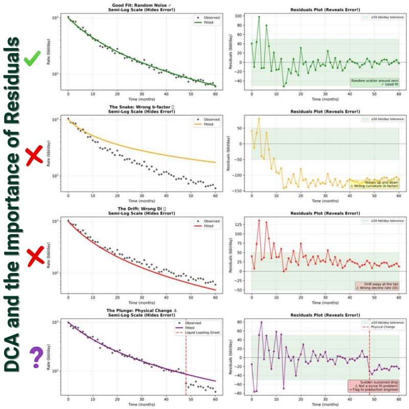

--- 
title: "Improving Production Forecasting Accuracy with Residual Analysis"
date: 2025-12-17T00:27:00
draft: false
description: "How to move beyond visual semi-log plots and use residuals to ensure technical integrity in your decline curve analysis."
topics: ["oil-and-gas", "time-series", "opinion"]
---

Your production forecast is likely launching from the wrong point.

The semi-log DCA plot is the industry standard, but it’s a trap. It conceals errors right at the end of the well’s productive life.

The logarithmic scale compresses data. A visually minor error in the current rate can translate into a 50% mismatch of the true production rate.

If you miss the current rate, your entire long-term forecast is launched from the wrong trajectory. The result is a substantial gap between your calculated production and what the well could deliver (we all know that there are many assumptions to DCA, though).

Complement your analysis using Residuals.

The solution is simple and purely technical: shift your view. Plot the residuals (model rate minus actual rate) on a linear scale. This immediately exposes the semi-log illusion.

Watch for these three patterns to ensure technical integrity in your production forecast:

1️⃣ The Snake (Autocorrelation): This indicates the b-factor is too aggressive. The well has already transitioned to boundary-dominated flow. Fix: Lower the b-factor until the residuals flatten and center on zero.

2️⃣ The Drift: You are misrepresenting the current decline momentum. The decline rate (Di) is incorrect for the last 12–18 months. Fix: Adjust the "Di" until the end of the residual plot aligns back to zero.

3️⃣ The Drop-off: The cause is physical, not mathematical (e.g., liquid loading or nearby stimulation interference). Action: Review what the possible causes are and assess whether you should use that last trend or not.
 
If the residuals at the end of the production history are not centered around zero, your long-term forecast is biased. Always prioritize the recent data points.

💬 When manually fitting curves for production forecasting, do you rely primarily on the visual match, or do you utilize a specific error metric to confirm the technical accuracy of your final curve?


