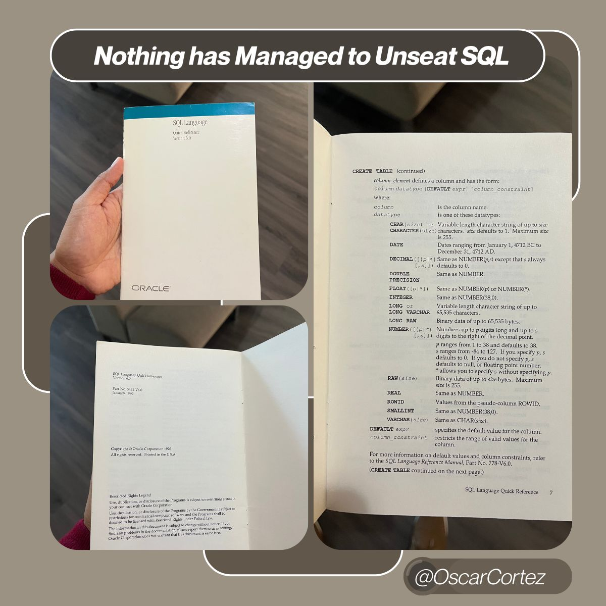

--- 
title: "SQL: The 35-Year-Old Language Still Powering Our Industries"
date: 2025-12-22T18:01:00
draft: false
description: "How SQL is still relevant today."
topics: ["excel", "opinion"]
---

This book is 35 years old. 
But the code inside it still runs our industries.

I found this relic last week, sitting on a stack of old manuals in the office. 
Most tech books from 1990 are useless today. But this one?
If you type the commands inside it into a modern cloud database... They will still run.

That is absolutely wild. 🤯

There is a bit of history here that most people forget: Oracle didn’t actually invent SQL. Researchers at IBM wrote the original paper. Larry Ellison (Oracle’s co-founder) just beat them to market.

But here is the subtle difference we often miss:
SQL is just the syntax, the language. The engines that power our industry, whether it's PostgreSQL for open-source projects, SQL Server for corporate IT, or SQLite running locally on your phone, all speak this same language.

Today, in Oil & Gas, we love to talk about the cutting edge: LLMs, Generative AI, and Agentic Workflows.

But our industry mostly runs on relational databases (and Excel files 😅).

From well headers and drilling logs to daily production allocations, the world’s energy data lives in tables.

🚫 You cannot build a robust predictive model if you cannot query the data first.
🚫 You cannot build an automated dashboard if you cannot join the tables.
🚫 You cannot be a "Data Scientist" if you are dependent on someone else to get the data for you.

SQL is a gatekeeper.

Abraham Lincoln once said:
Give me six hours to chop down a tree and I will spend the first four sharpening the axe.
In our world:
The Tree = The predictive model / The dashboard / The insight
The Axe = SQL and Data Preparation

If you skip the sharpening, you’re just hitting a tree with a dull piece of metal.
Don't let the hype distract you from the fundamentals. Sharpen your axe first. 🪓

Have you ever used SQL? If so, what for?


