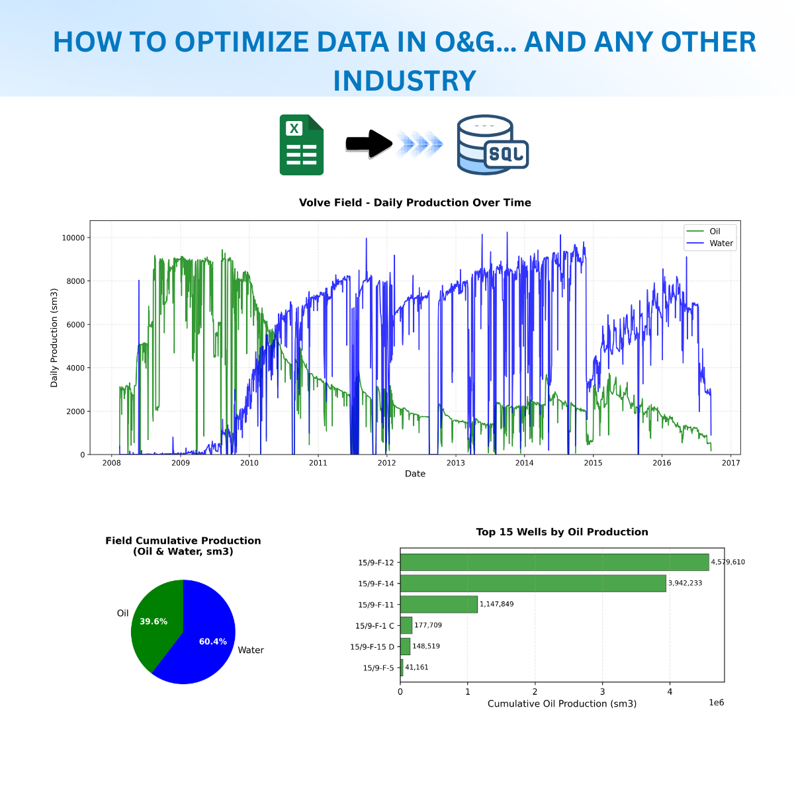

--- 
title: "From Excel to SQLite: Building a Reproducible Oil & Gas Production Database"
date: 2025-12-29T12:01:00
draft: false
description: "How SQL is still relevant today."
topics: ["excel", "opinion"]
---




## Introduction

Working with production data in the oil and gas industry often means dealing with Excel spreadsheets – lots of them. While Excel is great for quick analysis, it has limitations when it comes to data integrity, reproducibility, and complex queries. This post walks through a project I built to transform production data from the Equinor Volve dataset into a structured SQLite database, demonstrating how proper database design can make your data analysis more robust and your insights more reliable.

The [Volve dataset](https://www.equinor.com/energy/volve-data-sharing) is a complete set of data from a small oil field on the Norwegian Continental Shelf, released by Equinor for educational purposes. It includes production data, well logs, seismic data, and more – a treasure trove for anyone learning about petroleum data engineering.

## Why This Project Exists

This project serves as a practical, educational example of:

1. **Data transformation**: Converting messy Excel files into structured databases
2. **SQL fundamentals**: Using SQLAlchemy Core (not ORM) to stay close to raw SQL
3. **Reproducibility**: Creating a pipeline that anyone can run and verify
4. **Best practices**: Demonstrating data validation, referential integrity, and schema design

The goal isn't to build a production-ready application, but to create a learning resource that clearly exposes the transformation process and SQL operations.

## Technology Choices: Why These Tools?

### Why `uv` for Package Management?

I chose [uv](https://github.com/astral-sh/uv) as the package manager for several reasons:

1. **Speed**: uv is written in Rust and is significantly faster than pip or poetry
2. **Simplicity**: Single tool for virtual environments, dependency resolution, and package installation
3. **Modern**: Built with current Python packaging standards (PEP 621, pyproject.toml)
4. **Reproducibility**: Lock files ensure everyone gets the same dependency versions

Traditional `pip` with `requirements.txt` works fine, but `uv` makes the development experience smoother while maintaining the simplicity this educational project requires.

### Why SQLAlchemy Core (Not ORM)?

The project deliberately uses **SQLAlchemy Core** instead of the ORM. Here's why:

```python
# Core SQLAlchemy - SQL is visible and educational
query = text("""
    SELECT well_name, SUM(oil_volume) as total_oil
    FROM daily_production
    GROUP BY well_name
""")
result = conn.execute(query)

# vs ORM - SQL is hidden behind abstractions
session.query(Production).group_by(Production.well_name)...
```

When learning SQL and database concepts, seeing the actual SQL is crucial. The Core API keeps SQL explicit while still providing the benefits of SQLAlchemy's connection management and type handling.

### Why pandas + DuckDB + matplotlib?

- **pandas**: Required for reading Excel files (`pd.read_excel()`), which is where our source data lives
- **DuckDB**: Lightning-fast SQL queries on SQLite databases, perfect for analysis without loading everything into memory
- **matplotlib**: Industry-standard plotting library, familiar to most Python users
- **Polars**: Alternative to pandas for modern dataframe operations (used in analysis scripts)

## Project Setup: Getting Started

### Prerequisites

- Python 3.10 or higher
- The Volve production data Excel file (downloadable from Equinor's website)

### Installation Steps

**1. Clone the repository**

```bash
git clone https://github.com/yourusername/volve-db.git
cd volve-db
```

**2. Install uv** (if you haven't already)

```bash
# On macOS/Linux
curl -LsSf https://astral.sh/uv/install.sh | sh

# On Windows
powershell -c "irm https://astral.sh/uv/install.ps1 | iex"
```

**3. Create virtual environment and install dependencies**

This is where `uv` shines – it handles both the virtual environment and dependency installation in one command:

```bash
uv sync
```

That's it! `uv sync` reads the `pyproject.toml`, creates a virtual environment, installs all dependencies, and generates a lock file. No need for separate `python -m venv` and `pip install` commands.


**4. Download the Volve dataset**

Place the **Volve production data.xlsx** file in the `data/production/` directory:

```
volve-db/
└── data/
    └── production/
        └── Volve production data.xlsx
```

You're now ready to run the transformation pipeline!

## The Transformation Pipeline: Four Steps to a Database

The project follows a clear, linear workflow:

```
Excel → Explore → Schema Design → Load → Analyze
```

Let me walk through each step in detail.

---

## Step 1: Data Exploration (`analyze_production_data.py`)

**File**: `scripts/explore/analyze_production_data.py`

Before transforming data, you need to understand it. This script analyzes the structure of the Excel file to answer critical questions:

- What sheets does the file contain?
- What columns exist in each sheet?
- What are the data types?
- How much missing data do we have?
- What's the date range of the production data?

### Why pandas for this step?

pandas excels at exploratory data analysis:

```python
# Load Excel file
excel_file = pd.ExcelFile(excel_path)

# Analyze each sheet
for sheet_name in excel_file.sheet_names:
    df = pd.read_excel(excel_file, sheet_name=sheet_name)
    analyze_sheet(df, sheet_name)
```

The script provides detailed output for each sheet:

- **Shape**: Number of rows and columns
- **Column information**: Names, data types, null counts
- **Date ranges**: Production period covered
- **Numerical summaries**: Statistics for production volumes
- **Missing value analysis**: Which columns have gaps

### Running the exploration

```bash
uv run python scripts/explore/analyze_production_data.py
```

<script src="https://gist.github.com/oskrgab/f9863d2e571ffc9ae8aac3ae91e32956.js"></script>

### Key findings from exploration

The Excel file contains two sheets:

1. **Daily Production Data** (~17,000 rows)
   - Granular daily measurements per well
   - Operational metrics (pressure, temperature, choke size)
   - Production volumes (oil, gas, water)
   - Well metadata (codes, names, facilities)

2. **Monthly Production Data** (~400 rows)
   - Aggregated monthly totals per well
   - Simplified production volumes
   - Injection data (gas and water injection)

This exploration revealed the need for **three tables** in our database schema:

1. **wells** – Master table (one row per well)
2. **daily_production** – Time-series (one row per day per well)
3. **monthly_production** – Time-series (one row per month per well)

---

## Step 2: Schema Design (`create_tables.py`)

**File**: `scripts/transform/create_tables.py`

Armed with knowledge from exploration, we design the database schema. This is where SQLAlchemy Core shines – we define tables using Python, but the resulting SQL is transparent.

### Database schema overview


erDiagram
    wells ||--o{ daily_production : "has"
    wells ||--o{ monthly_production : "has"

    wells {
        int npd_wellbore_code PK
        text wellbore_code
        text wellbore_name
        int npd_field_code
        text npd_field_name
        int npd_facility_code
        text npd_facility_name
    }

    daily_production {
        date date PK
        int npd_wellbore_code PK,FK
        float on_stream_hours
        float oil_volume
        float gas_volume
        float water_volume
        float avg_downhole_pressure
        float avg_wellhead_pressure
        text well_type
    }

    monthly_production {
        date date PK
        int npd_wellbore_code PK,FK
        float on_stream_hours
        float oil_volume
        float gas_volume
        float water_volume
        float gas_injection
        float water_injection
    }


### Why this design?

**Normalization**: Well metadata (names, field codes, facilities) doesn't change over time, so we store it once in the `wells` table. Production measurements reference wells via foreign keys.

**Referential integrity**: Foreign key constraints ensure we never have production records for non-existent wells.

**Composite primary keys**: Time-series tables use `(date, npd_wellbore_code)` as primary keys – one record per well per time period.

### SQLAlchemy Core table definition

Here's how we define the `daily_production` table:

```python
daily_production = Table(
    TABLE_DAILY_PRODUCTION,
    metadata,
    Column(
        DAILY_DATE,
        Date,
        primary_key=True,
        nullable=False,
        comment="Production date",
    ),
    Column(
        DAILY_NPD_WELLBORE_CODE,
        Integer,
        ForeignKey(f"{TABLE_WELLS}.{WELLS_NPD_WELLBORE_CODE}"),
        primary_key=True,
        nullable=False,
        comment="Reference to wells table",
    ),
    Column(
        DAILY_BORE_OIL_VOL,
        Float,
        comment="Oil volume produced from bore",
    ),
    # ... more columns
)
```

Notice how clear this is – even if you've never used SQLAlchemy, you can see:
- The column names
- The data types
- Primary key and foreign key relationships
- Helpful comments

### Running schema creation

```bash
uv run python scripts/transform/create_tables.py
```

This script:
1. Prints a human-readable schema summary
2. Creates the `database/volve.db` SQLite file
3. Generates all three tables with indexes

<script src="https://gist.github.com/oskrgab/c1ae7df57fa70362d204a747bd25c5ba.js"></script>

The resulting SQL (generated by SQLAlchemy):

```sql
CREATE TABLE wells (
    npd_wellbore_code INTEGER PRIMARY KEY,
    wellbore_code TEXT NOT NULL,
    wellbore_name TEXT NOT NULL,
    npd_field_code INTEGER NOT NULL,
    npd_field_name TEXT NOT NULL,
    npd_facility_code INTEGER NOT NULL,
    npd_facility_name TEXT NOT NULL
);

CREATE TABLE daily_production (
    date DATE NOT NULL,
    npd_wellbore_code INTEGER NOT NULL,
    on_stream_hours FLOAT,
    oil_volume FLOAT,
    -- ... more columns
    PRIMARY KEY (date, npd_wellbore_code),
    FOREIGN KEY (npd_wellbore_code) REFERENCES wells(npd_wellbore_code)
);

CREATE INDEX ix_daily_date ON daily_production(date);
CREATE INDEX ix_daily_wellbore ON daily_production(npd_wellbore_code);

-- Similar for monthly_production
```

---

## Step 3: Data Loading (`load_data.py`)

**File**: `scripts/transform/load_data.py`

Now comes the ETL (Extract, Transform, Load) pipeline. This script orchestrates the complete data transformation:

1. **Extract**: Read Excel sheets into pandas DataFrames
2. **Transform**: Clean data, map columns, convert types
3. **Load**: Insert into SQLite database
4. **Validate**: Check data integrity

### The ETL workflow

```python
# 1. Load Excel data
daily_df = pd.read_excel(SOURCE_EXCEL_PATH, sheet_name=SHEET_DAILY)
monthly_df = pd.read_excel(SOURCE_EXCEL_PATH, sheet_name=SHEET_MONTHLY)

# 2. Load wells (unique well entities from daily data)
wells_count = load_wells_table(daily_df, engine)

# 3. Load daily production
daily_count = load_daily_production_table(daily_df, engine)

# 4. Load monthly production
monthly_count = load_monthly_production_table(monthly_df, engine)

# 5. Validate everything
validation_passed = validate_data_integrity(engine)
```

### Transform logic

Each loading function follows a pattern:

1. **Select relevant columns** from source DataFrame
2. **Map column names** from Excel to database schema
3. **Apply transformations** (convert dates, clean numeric values)
4. **Insert into database** using pandas' `to_sql()`

Example transformation for monthly data:

```python
# Monthly sheet has a header row with units - skip it
monthly_df = monthly_df[1:].copy()

# Convert Year + Month columns → single Date column
monthly_df[MONTHLY_DATE] = pd.to_datetime(
    monthly_df[[SOURCE_MONTHLY_YEAR, SOURCE_MONTHLY_MONTH]]
        .rename(columns={
            SOURCE_MONTHLY_YEAR: 'year',
            SOURCE_MONTHLY_MONTH: 'month'
        })
        .assign(day=1)  # First day of month
)

# Convert text to numeric (coerce errors to NaN)
for col in numeric_columns:
    monthly_df[col] = pd.to_numeric(monthly_df[col], errors='coerce')
```

### Data validation

After loading, the script runs integrity checks:

✓ **Foreign key integrity**: All production records reference valid wells
✓ **Primary key uniqueness**: No duplicate (date, well) combinations
✓ **Row count verification**: All tables have expected data

```python
# Example validation: Check for orphaned production records
query = """
    SELECT COUNT(*)
    FROM daily_production d
    LEFT JOIN wells w ON d.npd_wellbore_code = w.npd_wellbore_code
    WHERE w.npd_wellbore_code IS NULL
"""
result = conn.execute(text(query)).scalar()

if result > 0:
    print(f"✗ Found {result} daily records with invalid well references")
else:
    print("✓ All daily production records have valid well references")
```

### Running the data load

```bash
uv run python scripts/transform/load_data.py
```

<script src="https://gist.github.com/oskrgab/3694850f1b399168d1769093fd12cbb5.js"></script>


At this point, you have a clean, validated SQLite database ready for analysis!

---

## Step 4: Analysis & Visualization (`production_analysis.py`)

**File**: `scripts/analysis/production_analysis.py`

With the database built, we can now query it for insights. This script demonstrates:

1. **SQL queries** using DuckDB (fast SQLite analytics)
2. **Data manipulation** with Polars (modern DataFrame library)
3. **Visualization** with matplotlib

### Why DuckDB for analysis?

DuckDB is an analytical database that can query SQLite files directly:

```python
# Connect to SQLite database via DuckDB
conn = duckdb.connect(DATABASE_PATH, read_only=True)

# Run SQL query - DuckDB optimizes this
query = """
    SELECT
        date,
        SUM(oil_volume) as total_oil,
        SUM(water_volume) as total_water
    FROM daily_production
    WHERE oil_volume IS NOT NULL
    GROUP BY date
    ORDER BY date
"""

# Get results as Polars DataFrame
daily_totals = conn.execute(query).pl()
```

Benefits:
- **Fast**: Optimized for analytical queries (aggregations, joins)
- **SQL interface**: Use familiar SQL syntax
- **Direct SQLite access**: No need to copy data
- **Multiple output formats**: Return results as Polars, Pandas, Arrow, etc.

### Visualizations created

The script generates three plots in a single figure:

**1. Daily Field Production Over Time (Line Chart)**
```python
ax.plot(dates, daily_totals['total_oil'],
        label='Oil', color='green', linewidth=1.5)
ax.plot(dates, daily_totals['total_water'],
        label='Water', color='blue', linewidth=1.5)
```

Shows production trends across the field's lifetime – when did production peak? When did water cut increase?

**2. Field Cumulative Production Breakdown (Pie Chart)**
```python
values = [field_totals['oil'], field_totals['water']]
ax.pie(values, labels=['Oil', 'Water'], colors=['green', 'blue'],
       autopct='%1.1f%%')
```

Overall production split – how much oil vs. water was produced?

**3. Top Wells by Oil Production (Horizontal Bar Chart)**
```python
ax.barh(y_positions, top_wells['cumulative_oil'],
        color='green', alpha=0.7)
```

Which wells were the most prolific producers?

### Running the analysis

```bash
uv run python scripts/analysis/production_analysis.py
```

```
================================================================================
VOLVE PRODUCTION DATA ANALYSIS
================================================================================

Connecting to database: database/volve.db

Querying data...
  1. Daily field production totals
     → 3056 days of production data
  2. Cumulative oil production by well
     → 6 wells
  3. Field cumulative totals
     → Oil: 10,037,081 sm3
     → Gas: 1,475,370,436 sm3
     → Water: 15,318,578 sm3

Creating visualizations...
```

The script saves the visualization to `scripts/analysis/output/production_analysis.png`:


### Insights from the Volve field

Looking at the visualization, we can observe:

- **Production lifecycle**: Clear ramp-up period, plateau, and decline
- **Water breakthrough**: Water production increases over time (common in mature fields)
- **Well variability**: Some wells produced significantly more oil than others
- **Field economics**: Understanding cumulative production helps estimate field value

---

## Key Takeaways

### What We Built

✅ **Reproducible pipeline**: Anyone can clone, install with `uv sync`, and run

✅ **Educational codebase**: Clear SQL, explicit transformations, beginner-friendly

✅ **Data integrity**: Foreign keys, validation checks, proper schema design

✅ **Analysis-ready database**: Clean data structure for further exploration

### Skills Demonstrated

- **Data transformation**: Excel → structured database
- **SQL fundamentals**: Table design, relationships, indexes
- **Python data stack**: pandas, SQLAlchemy, DuckDB, matplotlib
- **Modern tooling**: uv for package management
- **Software engineering**: Modular code, validation, documentation

### Why This Matters

Many petroleum engineering workflows still rely heavily on Excel. While spreadsheets are quick for simple tasks, databases offer:

- **Data integrity**: Constraints prevent invalid data
- **Complex queries**: Multi-table joins, aggregations, filtering
- **Scalability**: Handle millions of rows efficiently
- **Reproducibility**: Clear transformation logic vs. manual Excel operations
- **Collaboration**: Multiple users querying same source of truth

This project demonstrates these benefits in a domain-specific context that petroleum engineers can relate to.

---

## Next Steps & Extensions

Interested in extending this project? Here are some ideas:

1. **Add more data sources**: Well logs, seismic surveys, completion reports
2. **Create a dashboard**: Build a Streamlit or Dash web interface
3. **Time-series forecasting**: Predict future production using historical data
4. **Decline curve analysis**: Fit Arps equations to production profiles
5. **Data quality monitoring**: Track missing data, outliers, anomalies over time
6. **API layer**: Expose database via REST API for other applications

The foundation is solid – the database schema is normalized, validated, and ready for whatever analysis you throw at it.

---

## Repository & Resources

- **GitHub Repository**: [github.com/yourusername/volve-db](https://github.com/yourusername/volve-db)
- **Volve Dataset**: [Equinor Volve Data Village](https://www.equinor.com/energy/volve-data-sharing)
- **uv Package Manager**: [astral.sh/uv](https://astral.sh/uv)
- **SQLAlchemy Core Tutorial**: [docs.sqlalchemy.org/en/core](https://docs.sqlalchemy.org/en/20/core/)
- **DuckDB Documentation**: [duckdb.org/docs](https://duckdb.org/docs/)

---

## Conclusion

Transforming Excel spreadsheets into structured databases might seem like extra work upfront, but the payoff is immense. You gain data integrity, query flexibility, and reproducibility – crucial for any serious data analysis project.

This project shows that building data pipelines doesn't require complex frameworks or cloud infrastructure. With Python, SQLite, and a few well-chosen libraries, you can create professional-grade data workflows that run on a laptop.

Whether you're a petroleum engineer looking to modernize your workflows, a data engineer exploring new domains, or a student learning SQL and databases, I hope this walkthrough gives you practical insights you can apply to your own projects.

If you found this useful, feel free to star the repository, fork it, or reach out with questions. Happy data engineering! 🛢️📊
