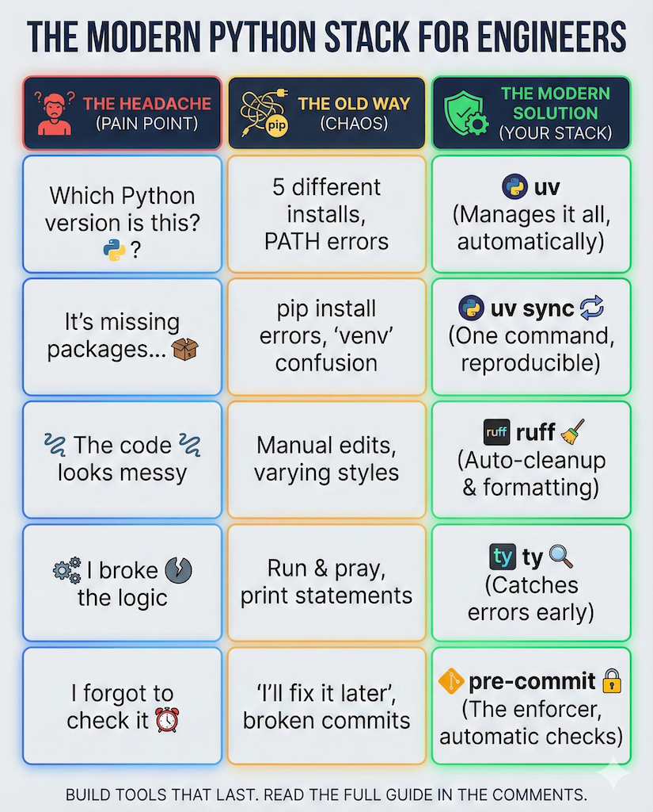
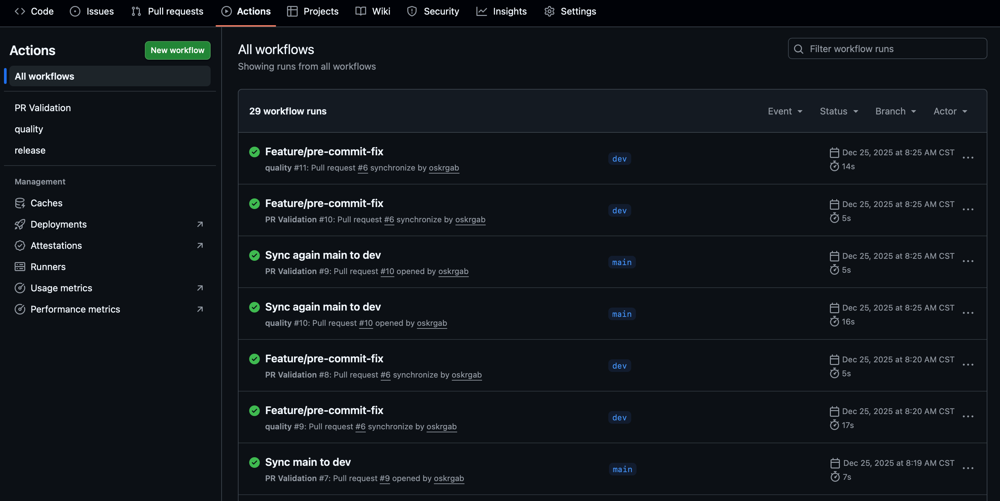

If you're an engineer who writes Python scripts to solve problems—whether it's calculating relative permeabilities, modeling heat transfer, or analyzing production data—this guide is for you.

I recently challenged myself to publish a Python package with some petroleum engineering functionality (specifically, relative permeabilities and capillary pressures). Along the way, I discovered how much the Python ecosystem has improved. Gone are the days of wrestling with `pip install` errors and virtual environment headaches.

This is **Part 1** of a three-part series. Here, we'll focus on *why* we set things up the way we do, and *what* this modern tooling enables. We won't dive into every terminal command—you'll be using VSCode for most of this anyway.

## Why Should You Care About Any of This?

Let me paint a picture you might recognize: You wrote a Python script six months ago. It worked perfectly. Now you need it again, and... nothing works. Python version mismatch. Missing packages. That one library updated and broke everything.

Or maybe: You're collaborating with a colleague. They send you their script. It doesn't run on your machine because they have different packages installed.

**Modern Python tooling solves these problems.** Here's what we're setting up and why:

| Tool | What It Does | Why You Care |
|------|--------------|--------------|
| **uv** | Manages Python versions and packages | "It just works" on any machine |
| **Git + GitHub** | Tracks changes, enables collaboration | Never lose your work, easy sharing |
| **ruff** | Checks and formats your code | Catch bugs before they bite |
| **ty** | Checks your types | Find mistakes before running code |
| **pre-commit** | Runs checks automatically | Enforces quality without thinking |

## Version Control: Your Safety Net

Before we talk about Python tools, let's address something fundamental: **version control with Git**.

If you've ever had files named `script_v2_final_FINAL_actually_final.py`, you understand the problem Git solves.

### What Git Actually Does For You

Think of Git as an "infinite undo" for your entire project:

- **Track every change**: See exactly what you modified and when
- **Experiment freely**: Try new approaches without fear—you can always go back
- **Collaborate**: Multiple people can work on the same project without overwriting each other
- **Backup**: Your code lives on GitHub, not just your laptop

### GitHub: Git in the Cloud

 Github Repository")

GitHub is where your Git repository lives online. It provides:

- **Backup**: Your laptop could die tomorrow and your code survives
- **Sharing**: Send a link instead of a zip file
- **Automation**: Run tests and checks automatically (more on this in Part 3)
- **Publishing**: Host your documentation and release your package

 project")

## Installing UV: The Modern Python Manager

 features")

UV is a significant improvement. It's a single tool that replaces the confusing mix of `pip`, `virtualenv`, `poetry`, and `conda` that used to be the Python experience.

### Why UV Over the Old Way?

Remember these frustrations?

- "Which Python version is installed?" (trick question—you probably have 5)
- "Is my virtual environment activated?"
- "Why does `pip install` take forever?"
- "Works on my machine..."

UV eliminates all of this:

```bash
# Install UV (one-time setup)
curl -LsSf https://astral.sh/uv/install.sh | sh  # macOS/Linux
```

That's it. uv now handles:
- **Python versions**: Automatically downloads the right Python for each project
- **Virtual environments**: Created and managed for you
- **Package installation**: 10-100x faster than pip (seriously)
- **Lock files**: Guarantees everyone uses identical package versions

## Creating Your Project

With UV installed, creating a new project is simple:

```bash
uv init relperm
cd relperm
```

UV creates your starter files:

```
relperm/
├── .python-version    # Which Python version to use
├── pyproject.toml     # Project configuration (we'll explore this)
├── README.md          # Description of your project
└── main.py            # A starter script
```

Here's what the initial `pyproject.toml` looks like—UV created this for us:

```toml
[project]
name = "relperm"
version = "0.1.0"
description = "Add your description here"
readme = "README.md"
requires-python = ">=3.12"
dependencies = []
```

This one file defines your entire project. No more scattered `requirements.txt`, `setup.py`, and `setup.cfg` files.

## The Project Structure: Why It Matters

Now let's organize the project properly. Here's the structure we're building toward:

```
relperm/
├── src/
│   └── relperm/          # Your actual code lives here
│       ├── __init__.py
│       └── relperm.py
├── tests/                # Tests for your code
│   └── test_relperm.py
├── docs/                 # Documentation
│   └── index.md
├── .github/
│   └── workflows/        # Automation (Part 3)
├── pyproject.toml        # The single source of truth
└── README.md
```

### Why This Structure?

**The `src/` layout**: Your code goes inside `src/relperm/`, not at the root. This prevents a subtle but common bug where tests accidentally import from your local folder instead of the installed package. Trust me, this saves headaches.

Relative permeabily correlations and equations are quite straightforward. I created a `relperm.py` where I added the following functions:

```python
import numpy as np
import numpy.typing as npt

def s_eff(
    sw: npt.NDArray[np.float64], swr: np.float64, snwr: np.float64
) -> npt.NDArray[np.float64]:

    s_eff_array = (sw - swr) / (1 - swr - snwr)

    return s_eff_array


def krw(
    s_eff: npt.NDArray[np.float64], krw0: np.float64, nw: np.float64
) -> npt.NDArray[np.float64]:

    krw_array = krw0 * s_eff**nw

    return krw_array
```

We'll use these functions as an example to create tests and documentation later on.

**The `tests/` directory**: Keeps your tests separate from your code. You write tests to verify your equations and calculations work correctly—especially important for engineering code where mistakes can be costly.

For this quick example we wrote two tests in `test_relperm.py`:

```python
import numpy as np

from relperm.relperm import krw, s_eff


def test_s_eff_basic():
    """Test effective saturation calculation with basic inputs."""
    sw = np.array([0.3, 0.5, 0.7])
    swr = np.float64(0.2)
    snwr = np.float64(0.1)
    result = s_eff(sw, swr, snwr)
    expected = np.array([0.142857, 0.428571, 0.714286])
    np.testing.assert_allclose(result, expected, rtol=1e-5)


def test_krw_basic():
    """Test water relative permeability calculation with basic inputs."""
    s_eff_values = np.array([0.0, 0.5, 1.0])
    krw0 = np.float64(0.8)
    nw = np.float64(2.0)
    result = krw(s_eff_values, krw0, nw)
    expected = np.array([0.0, 0.2, 0.8])
    np.testing.assert_allclose(result, expected, rtol=1e-5)
```

You can now go to your terminal and run:

```bash
uv run pytest
```

Or, right click on your test folder and select "Run Tests""


You will see an output in your dedicated "Test Results" window in VSCode:


**The `docs/` directory**: Documentation lives here. We'll use a tool called MkDocs that turns simple markdown files into a beautiful website (for free!). We will have a deep dive into this in Part 2, but for now, just know that the purpose is to add some docstrings to our code, like the following:

```python
def s_eff(
    sw: npt.NDArray[np.float64], swr: np.float64, snwr: np.float64
) -> npt.NDArray[np.float64]:
    r"""Calculate the effective wetting phase saturation.

    Parameters
    ----------
    sw : npt.NDArray[np.float64]
        Wetting phase saturation array.
    swr : np.float64
        Residual wetting phase saturation.
    snwr : np.float64
        Residual non-wetting phase saturation.

    Returns
    -------
    npt.NDArray[np.float64]
        Effective wetting phase saturation array.

    Notes
    -----
    The effective saturation ($S_{eff}$) is calculated using the formula:

    $$S_{eff} = \frac{S_w - S_{wr}}{1 - S_{wr} - S_{nwr}}$$

    where:

    - $S_w$: Wetting phase saturation.
    - $S_{wr}$: Residual wetting phase saturation.
    - $S_{nwr}$: Residual non-wetting phase saturation.
    """
    s_eff_array = (sw - swr) / (1 - swr - snwr)

    return s_eff_array
```

And have it automatically rendered in a beautiful style like this:

")


**The `.github/workflows/` directory**: Automation scripts that run on GitHub. Every time you push code, GitHub can automatically run your tests and check for errors. We'll set this up in Part 3, but here is a sneak peak on how that looks like when a new PR is merged into main:




## Adding Development Tools

Here's where it gets interesting. We're going to add tools that automatically catch bugs and format our code. 

While you can manually edit `pyproject.toml`, the easiest way is to use the terminal. UV makes it simple to add tools specifically for development:

```bash
uv add --dev pytest ruff ty pre-commit
```

This command automatically updates your `pyproject.toml` and adds a `dependency-groups` section:

```toml
[project]
name = "relperm"
# ... other project settings ...
dependencies = [
    "numpy>=2.3.2",
]

[dependency-groups]
dev = [
    "pytest>=8.4.2",
    "ruff>=0.14.10",
    "ty>=0.0.5",
    "pre-commit>=4.5.1",
]
```

After adding them, ensure everything is in sync:

```bash
uv sync
```

uv creates a virtual environment, downloads the right Python version if needed, and installs all dependencies. One command. No activation needed.

### What These Tools Do

**pytest**: Runs your tests. You write small functions that verify your calculations are correct.

**ruff**: This is like having a code reviewer looking over your shoulder. It catches:
- Unused imports and variables
- Common bugs and gotchas
- Style inconsistencies
- Missing documentation

**ty**: Checks that your types make sense. If you pass a string where a number is expected, Ty catches it before you run the code.

**pre-commit**: The enforcer. Runs Ruff and other checks automatically every time you commit. You literally cannot commit bad code.

## Configuring Ruff: The Linter

Add this configuration to your `pyproject.toml`:

```toml
[tool.ruff]
line-length = 88
target-version = "py312"

[tool.ruff.lint]
select = [
    "E",    # Style errors
    "F",    # Logic errors
    "I",    # Import sorting
    "B",    # Common bugs
    "UP",   # Modern Python syntax
    "N",    # Naming conventions
    "D",    # Docstrings (documentation)
    "NPY",  # NumPy best practices
]
ignore = ["D100", "D104"]  # Don't require docstrings for modules

[tool.ruff.lint.pydocstyle]
convention = "numpy"  # Use NumPy-style docstrings

[tool.ruff.format]
quote-style = "double"
indent-style = "space"
```

Now you can run:

```bash
uv run ruff check .      # Find issues
uv run ruff check --fix . # Auto-fix what it can
uv run ruff format .     # Format your code consistently
```

## Configuring ty: The Type Checker

Add this simple configuration:

```toml
[tool.ty.environment]
python-version = "3.12"
```

Run it with:

```bash
uv run ty check
```

ty reads your type hints (like `def calculate(x: float) -> float:`) and verifies they're consistent throughout your code.

## pre-commit: Automatic Quality Checks

Create a file called `.pre-commit-config.yaml` in your project root:

```yaml
repos:
  - repo: https://github.com/astral-sh/ruff-pre-commit
    rev: v0.9.2
    hooks:
      - id: ruff
        args: [--fix]
      - id: ruff-format

  - repo: https://github.com/pre-commit/pre-commit-hooks
    rev: v5.0.0
    hooks:
      - id: trailing-whitespace
      - id: end-of-file-fixer
      - id: check-yaml
      - id: check-toml
```

Install the hooks:

```bash
uv run pre-commit install
```

Now, every time you try to commit code, these checks run automatically. If something fails, the commit is blocked until you fix it. This sounds strict, but it's actually liberating—you never have to worry about committing broken code.


## Pushing to GitHub

If you have the GitHub CLI installed, creating your repository is simple:

```bash
git init
git add .
git commit -m "Initial project structure"
gh repo create relperm --public --source=. --push
```

Your code is now on GitHub, backed up and ready to share.

## What We've Accomplished

Let's step back and appreciate what we have:

1. **Reproducible environment**: Anyone can clone your repo, run `uv sync`, and get the exact same setup
2. **Automatic quality checks**: Ruff catches bugs, Ty catches type errors, pre-commit enforces both
3. **Professional structure**: Your code is organized in a way that scales and follows Python best practices
4. **Version control**: Every change is tracked, you can collaborate, and your work is backed up

This might seem like a lot of setup for "just a Python script." But this foundation pays dividends:

- Your code works months later
- Others can use and contribute to your work
- You catch bugs before they cause problems
- Publishing to PyPI becomes straightforward (Part 3)

## Coming Up in Part 2

In the next post, we'll focus on **Documentation**:
- **MkDocs**: Turn your simple markdown files and code comments into a professional website
- **Material for MkDocs**: Make it look beautiful and modern
- **Docstrings**: Best practices for documenting your engineering functions

The goal is to make your project easy for others (and your future self) to understand and use. We'll save the automation and CI/CD for Part 3!

See you in Part 2!

---

*This post is part of a series documenting the creation of [relperm](https://github.com/oskrgab/relperm), a Python library for petroleum engineering relative permeability calculations.*
