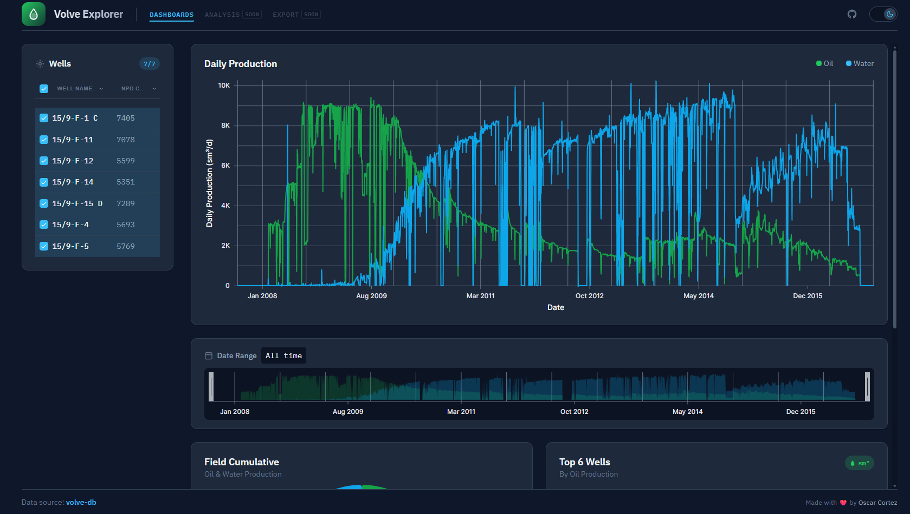

I built an oil production dashboard.
Without a single line of Python.

And no… it’s not Streamlit.

Like most people in Oil & Gas, my first instinct was Python. That’s what we use for everything: analysis, forecasts, dashboards.

But this time I wanted something else.

I wanted a dashboard that:

🟢 Feels instant

🟢 Looks like a real product, not a prototype

🟢 Works as a static site

🟢 Can query years of production data without loading everything

So I skipped the usual stack.

I used Svelte for the frontend and DuckDB Wasm for the data.

Svelte compiles to plain JavaScript.
No heavy runtime. No lag. Just a smooth UI.

DuckDB Wasm was the real surprise.
It doesn’t download the whole dataset.
It only fetches the exact pieces of data needed for each query (HTTP Range Requests).

Ask for “oil last month”?
Only those rows are loaded.

As a result, I got a production dashboard that feels instantaneous, with zero backend.

I open-sourced the project (Volve Explorer).

You can find the links below:
- 🌐 [Live Web App](https://volve-explorer.ocortez.com/)
- 🗄️ [Data Source Page](https://volve-db.ocortez.com/)
- 💻 [volve-explorer repo](https://github.com/oskrgab/volve-explorer)
- 🐍 [volve-db repo](https://github.com/oskrgab/volve-db)

Curious if this approach could work for your own field data or dashboards 👀

Happy to discuss.




