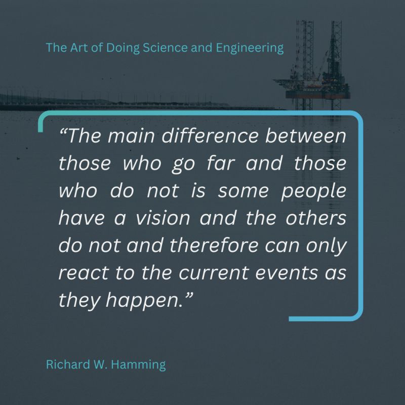

For people in Upstream Oil & Gas, the “AI replacing jobs” headline is everywhere.

But how much of it actually reflects what’s happening on the ground?

Let’s skip the hype and think clearly.
Predicting what’s coming isn’t about attention, but deciding what to learn next and how to prepare.

As Richard W. Hamming said in “The Art of Doing Science and Engineering”, those who go far have a vision; the rest just react.

Here’s my take.

Oil & Gas adopts technology slowly by nature.
So no, agentic AI won’t replace subsurface teams overnight.

Yes, we’re hearing about layoffs linked to AI in the tech sector.
The Tailwind case is often mentioned.

But that wasn’t developers being replaced.
It was a monetization challenge: their open-source documentation became embedded into LLMs, traffic dropped, and the business model had to change.

That’s very different from AI doing the job itself.

In O&G, agentic AI still needs:

⏺️ Access to specialized software
⏺️ Heavy domain workflows (simulation, subsurface modeling, interpretation)
⏺️ Significant compute
⏺️ And domain context that isn’t public or standardized

That creates friction, which gives us time.

This doesn’t mean AI will fail here.
It means you still have time to position yourself.

If you’re an O&G engineer, here’s what makes sense to try now:

❇️ Learn how agentic workflows are built
❇️ Develop domain tools AI will rely on
❇️ Connect those tools to open frameworks (MCP, skills, APIs)
❇️ Improve performance so they can run in automated workflows
❇️ And yes, learn to code (try Vibe Coding at least to have a feeling of what you can do)

When AI truly arrives in our industry,
you don’t want to be catching up.

You want to be ready to work with it.

Where do you see agentic AI adding value in your industry?


